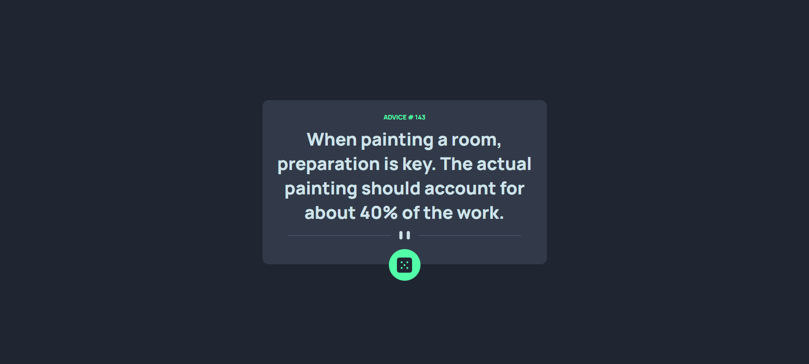

## Table of contents

- [Overview](#overview)
  - [The challenge](#the-challenge)
  - [Screenshot](#screenshot)
  - [Links](#links)
- [My process](#my-process)
  - [Built with](#built-with)
  - [What I learned](#what-i-learned)
- [Author](#author)

## Overview

### The challenge
Users should be able to: see hover state and get advice one dice is clicked

### Screenshot

### Links
- Solution URL: [https://github.com/activus-d/advice-generator-app-main](https://github.com/activus-d/advice-generator-app-main))
- Live Site URL: [ https://activus-d.github.io/advice-generator-app-main/](https://activus-d.github.io/advice-generator-app-main/)

## My process

### Built with
- Semantic HTML5 markup
- CSS custom properties
- Flexbox

### What I learned
Able to pracice more with fetching data from API

## Author

- Blog - [D.M. Oladele](https://activuscode.hashnode.dev/)
- Twitter - [@activus_d](https://twitter.com/activus_d)

